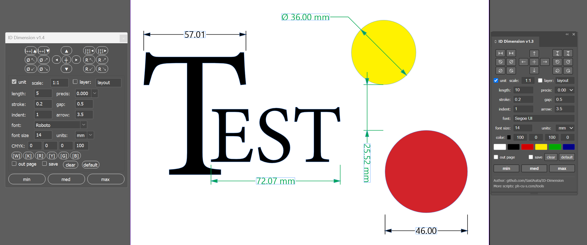

# ID Dimension v1.4



*( 🇬🇧 [English](#english) | 🇷🇺 [Русский](#русский) )*

---

<a id="english"></a>
## 🇬🇧 English

**ID Dimension** is a powerful tool for Adobe InDesign designed to automatically draw technical dimensions, bounds, and leader lines for page items and vector objects.

This repository includes **two versions** of the tool in one package:
1. **Modern CEP Extension** — A native, dockable panel with a sleek HTML/JS interface (CC 2014+).
2. **Standalone Script (ScriptUI)** — A classic `.jsx` script that opens as a floating palette. It is easier to install, requires no registry tweaks, and is highly compatible with older InDesign versions.

### Main Features and Capabilities
* **Two UI options** — Choose between a modern dockable panel (CEP) or a lightweight floating ScriptUI palette (`.jsx`).
* **Cross-platform** — Fully supports **Windows** and **macOS** (including Apple Silicon & macOS Sequoia).
* **Searchable Font Picker (`font`)** — Fast font selection directly in the panel with instant search, caching, and recently used fonts.
* **4-Direction Gap Measurement** — Dedicated buttons for measuring horizontal gap (Top / Bottom) and vertical gap (Left / Right) between two selected objects.
* **4-Quadrant Radius & Diameter** — Measure circle radius (`R`) and diameter (`Ø`) in all 4 directions (Top-Left, Top-Right, Bottom-Left, Bottom-Right) with dedicated horizontal landing shelves.
* **Drawing Scale support (`scale`)** — Support for scaled drawings (e.g. `1:10`, `1:50`, `1:100`, `2:1`, or a numeric multiplier like `10`). Perfect for architecture, large-format graphics, dielines, and exhibition stands where 75 mm represents 750 mm in reality.
* **Measurement units** — Choose between mm, cm, in, pt, and px. The math automatically adapts to your workflow, and the selected unit can be displayed next to the number (the `unit` option).
* **Drafting Standards Compliance** — Continuous dimension lines and proper formatting compliant with ГОСТ / ISO standards when dimensions are narrow.
* **Color presets (CMYK)** — Set custom colors for dimension lines and text. Includes 6 customizable color swatch slots.
* **Settings preservation** — Automatically remembers your settings across InDesign sessions (stored locally).
* **3 preset slots (min / med / max)** — Quick switching between prepared dimension styles. Overwrite them by enabling `save` mode.
* **Single-Step Undo** — All generated objects for an action are wrapped in a single InDesign undo step.
* **Clear all dimensions (`clear`)** — Instantly remove all dimension markings generated by ID Dimension across the document.
* **Reset to factory defaults (`default`)** — Reset all options and swatches back to initial defaults at any time.

### Dimensioning Tools
* Dimensioning width (top / bottom) and height (left / right).
* 4 dedicated buttons for horizontal and vertical gap measurement between two selected objects.
* Measuring the radius and diameter of circles in all 4 directions with landing shelves.
* Marking the center of an object.
* Customizable appearance: stroke weight, gap, indent, arrow size, font family, font size, drawing scale, and precision (up to 3 decimal places).
* Moving all dimensions to a designated separate layer (`layer` option).
* Option to place dimensions outside the active page/spread boundary (`out page` / `out artboard` option).

### Installation

You can install either the modern Extension or the Standalone Script (or both).

#### Option A: Modern CEP Extension (Dockable Panel)
Supports Adobe InDesign CC 2014 – 2026+ on Windows & macOS.

**Windows:**
1. **Enable Debug Mode:** Run the `enable_player_debug_mode.reg` file by double-clicking it and confirm adding changes to the registry.
2. **Copy Files:** Press `Win + R`, paste `%APPDATA%\Adobe\CEP\extensions\`, and copy the entire `ID Dimension` folder there.
3. **Launch:** Restart InDesign -> `Window -> Extensions -> ID Dimension` (or `Extensions (Legacy)`).

**macOS:**
1. **Enable Debug Mode:** Open Terminal and execute:
   ```bash
   defaults write com.adobe.CSXS.9 PlayerDebugMode 1; defaults write com.adobe.CSXS.10 PlayerDebugMode 1; defaults write com.adobe.CSXS.11 PlayerDebugMode 1; defaults write com.adobe.CSXS.12 PlayerDebugMode 1; defaults write com.adobe.CSXS.13 PlayerDebugMode 1; defaults write com.adobe.CSXS.14 PlayerDebugMode 1; defaults write com.adobe.CSXS.15 PlayerDebugMode 1; defaults write com.adobe.CSXS.16 PlayerDebugMode 1
   ```
2. **Copy Files:** In Finder press `Cmd + Shift + G`, paste `~/Library/Application Support/Adobe/CEP/extensions/` (create the folder if it doesn't exist), and copy the `ID Dimension` folder there.
3. **Launch:** Restart InDesign -> `Window -> Extensions -> ID Dimension` (or `Extensions (Legacy)`).

#### Option B: Standalone Script (Floating Palette)
No registry or terminal tweaks needed.

* **Windows:** Copy `ID Dimension.jsx` to `%APPDATA%\Adobe\InDesign\Version <XX.X>\<Locale>\Scripts\Scripts Panel\`
* **macOS:** Copy `ID Dimension.jsx` to `~/Library/Preferences/Adobe InDesign/Version <XX.X>/<Locale>/Scripts/Scripts Panel/`
  *(Tip: in InDesign open `Window -> Utilities -> Scripts`, right click "User" folder and select "Reveal in Finder" / "Reveal in Explorer").*
* **Launch:** Double-click `ID Dimension.jsx` in the InDesign Scripts panel.

## 🛠️ Other Projects

**[AI Dimension](https://github.com/SaidAuita/AI-Dimension)**
* A similar extension designed specifically for Adobe Illustrator.

**[ComfyUI Photoshop Plugin (PH-CU-S)](https://github.com/SaidAuita/ComfyUI_PH-CU-S)**
* A powerful Photoshop plugin powered by ComfyUI, providing direct integration with local generative models.

---

<a id="русский"></a>
## 🇷🇺 Русский

**ID Dimension** — это мощный инструмент для Adobe InDesign, предназначенный для автоматического проставления технических размеров, габаритов и выносных линий к объектам и фреймам.

В этом репозитории представлены сразу **две версии** инструмента:
1. **Современное CEP-расширение** — нативная закрепляемая панель с современным HTML/JS интерфейсом (для версий CC 2014+).
2. **Отдельный скрипт (ScriptUI)** — классический скрипт (`.jsx`), который открывается в виде плавающей палитры. Он проще в установке, не требует правок реестра и отлично работает в любых версиях InDesign.

### Основные возможности
* **Два варианта интерфейса** — выбирайте между современной закрепляемой панелью и легкой плавающей палитрой ScriptUI.
* **Кроссплатформенность** — полная поддержка **Windows** и **macOS** (включая Apple Silicon и macOS Sequoia).
* **Поиск и выбор шрифта (`font`)** — быстрый поиск и выбор установленных гарнитур с умным фильтром и кэшированием.
* **4 направления зазора между объектами** — отдельные кнопки для измерения точного расстояния между 2 объектами по горизонтали (сверху/снизу) и по вертикали (слева/справа).
* **4 квадранта для радиуса и диаметра** — измерение радиуса (`R`) и диаметра (`Ø`) во все 4 стороны (вверх-влево, вверх-вправо, вниз-влево, вниз-вправо) с горизонтальной полочкой-площадкой.
* **Поддержка масштаба чертежа (`scale`)** — возможность задать масштаб макета (например, `1:10`, `1:50`, `1:100`, `2:1` или числовой множитель вроде `10`). Удобно при разработке наружной рекламы, стендов и крупногабаритной упаковки.
* **Единицы измерения** — поддержка выбора размерностей (mm, cm, in, pt, px). Математика скрипта автоматически адаптируется под ваш документ, а выбранную единицу измерения можно выводить рядом с числом (опция `unit`).
* **Соответствие стандартам черчения** — непрерывная размерная линия при выносе текста наружу (по ГОСТ / ISO).
* **Цветовые пресеты (CMYK)** — настройка цвета выносных линий и текста. Есть 6 ячеек для сохранения собственных цветов.
* **Сохранение настроек** — панель автоматически запоминает все параметры между сессиями работы в InDesign.
* **3 слота для пресетов (min / med / max)** — быстрое переключение между заготовленными стилями размеров.
* **Единый шаг отмены (Undo)** — создание размера отменяется за одно нажатие `Ctrl+Z` / `Cmd+Z`.
* **Удаление всех размеров (`clear`)** — быстрая очистка документа от всех созданных плагином выносок.
* **Сброс до заводских настроек (`default`)** — возврат всех значений и цветов к состоянию по умолчанию.

### Функционал
* Простановка ширины (сверху / снизу) и высоты (слева / справа).
* 4 отдельные кнопки для простановки горизонтального и вертикального зазора между объектами.
* Измерение радиуса и диаметра окружностей во всех 4 направлениях с полочкой-выноской.
* Пометка центра объекта.
* Гибкая настройка: толщина линии (stroke), отступ от объекта (gap), вынос линии (indent), размер стрелки (arrow), выбор шрифта (font), размер шрифта, масштаб (scale) и точность округления (до 3 знаков).
* Вынос всех размеров на отдельный слой (опция `layer`).
* Возможность выносить размеры за пределы страницы / разворота (опция `out page`).

### Установка

Вы можете установить либо современное расширение, либо отдельный скрипт (или оба варианта сразу).

#### Вариант А: Современное CEP-расширение (Закрепляемая панель)
Поддерживает версии Adobe InDesign CC 2014 – 2026+ на Windows и macOS.

**Windows:**
1. **Включение режима отладки:** Запустите файл `enable_player_debug_mode.reg` двойным кликом и подтвердите добавление изменений в реестр.
2. **Копирование файлов:** Нажмите `Win + R`, вставьте `%APPDATA%\Adobe\CEP\extensions\` и скопируйте туда папку `ID Dimension`.
3. **Запуск:** Перезапустите InDesign -> `Окно -> Расширения -> ID Dimension` (или `Расширения (устаревшие)`).

**macOS:**
1. **Включение режима отладки:** Откройте программу "Терминал" (Terminal) и выполните:
   ```bash
   defaults write com.adobe.CSXS.9 PlayerDebugMode 1; defaults write com.adobe.CSXS.10 PlayerDebugMode 1; defaults write com.adobe.CSXS.11 PlayerDebugMode 1; defaults write com.adobe.CSXS.12 PlayerDebugMode 1; defaults write com.adobe.CSXS.13 PlayerDebugMode 1; defaults write com.adobe.CSXS.14 PlayerDebugMode 1; defaults write com.adobe.CSXS.15 PlayerDebugMode 1; defaults write com.adobe.CSXS.16 PlayerDebugMode 1
   ```
2. **Копирование файлов:** В Finder нажмите `Cmd + Shift + G`, вставьте `~/Library/Application Support/Adobe/CEP/extensions/` (создайте папку, если отсутствует) и скопируйте туда папку `ID Dimension`.
3. **Запуск:** Перезапустите InDesign -> `Окно -> Расширения -> ID Dimension` (или `Расширения (устаревшие)`).

#### Вариант Б: Отдельный скрипт (Плавающая палитра)
Не требует включения режима отладки.

* **Windows:** Скопируйте `ID Dimension.jsx` в `%APPDATA%\Adobe\InDesign\Version <XX.X>\<Locale>\Scripts\Scripts Panel\`
* **macOS:** Скопируйте `ID Dimension.jsx` в `~/Library/Preferences/Adobe InDesign/Version <XX.X>/<Locale>/Scripts/Scripts Panel/`
  *(Совет: в InDesign откройте `Окно -> Утилиты -> Сценарии`, кликните правой кнопкой мыши по папке "Пользователь" и выберите "Показать в Finder" / "Показать в Проводнике").*
* **Запуск:** В панели скриптов InDesign дважды кликните по `ID Dimension.jsx`.

## 🛠️ Мои проекты

**[AI Dimension](https://github.com/SaidAuita/AI-Dimension)**
* Аналогичное расширение, разработанное специально для Adobe Illustrator.

**[ComfyUI Photoshop Plugin (PH-CU-S)](https://github.com/SaidAuita/ComfyUI_PH-CU-S)**
* Мощный плагин для Photoshop на базе ComfyUI, обеспечивающий прямую интеграцию с локальными генеративными моделями.
